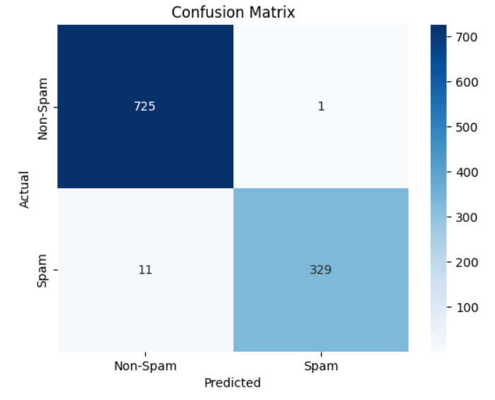

# Spam-Email-Detection-using-Machine-Learning
# 📧 Spam Email Detection using Machine Learning

A machine learning project for detecting spam emails using Natural Language Processing (NLP) techniques and Logistic Regression.

## 📖 Overview

Spam emails are one of the most common cybersecurity and communication problems. This project aims to automatically classify emails as **Spam** or **Ham (Non-Spam)** based on their textual content.

The model is trained on the SpamAssassin dataset and uses TF-IDF vectorization combined with Logistic Regression for binary classification.

---

## 🚀 Features

* Email text preprocessing and cleaning
* Stopword removal using NLTK
* URL, punctuation, and number removal
* TF-IDF feature extraction
* Logistic Regression classifier
* Model evaluation with multiple metrics
* Confusion Matrix visualization
* Trained model saving using Joblib

---

## 🛠️ Technologies Used

* Python 3.x
* Pandas
* NumPy
* Scikit-learn
* NLTK
* Matplotlib
* Seaborn
* Joblib

---

## 📂 Project Structure

```text
spam-email-detection/
│
├── spam_emails_detection.ipynb
├── dataset/
│   └── spam_assassin.csv
│
├── models/
│   └── spam_classifier.pkl
│
├── images/
│   ├── confusion_matrix.png
│   └── workflow.png
│
├── requirements.txt
└── README.md
```

---

## ⚙️ Installation

### 1. Clone the repository

```bash
git clone https://github.com/yourusername/spam-email-detection.git
cd spam-email-detection
```

### 2. Create a virtual environment (Optional)

```bash
python -m venv venv
```

Activate it:

Windows:

```bash
venv\Scripts\activate
```

Linux/Mac:

```bash
source venv/bin/activate
```

### 3. Install dependencies

```bash
pip install -r requirements.txt
```

---

## 📊 Dataset

This project uses the SpamAssassin Email Dataset.

Target labels:

| Label | Meaning        |
| ----- | -------------- |
| 0     | Ham (Not Spam) |
| 1     | Spam           |

---

## 🔄 Workflow

1. Load dataset
2. Data cleaning
3. Text preprocessing
4. TF-IDF vectorization
5. Train-test split
6. Logistic Regression training
7. Model evaluation
8. Save trained model

---

## 💻 Usage

Run the Jupyter Notebook:

```bash
jupyter notebook
```

Open:

```text
spam_emails_detection.ipynb
```

Execute all cells to:

* Train the model
* Evaluate performance
* Generate metrics and visualizations
* Save the trained classifier

---

## 🧪 Example Prediction

```python
email = "Congratulations! You have won $1000. Click here now."

prediction = model.predict(vectorizer.transform([email]))

print(prediction)
```

Output:

```text
Spam
```

---

## 📈 Results

Evaluation metrics include:

* Accuracy
* Precision
* Recall
* F1-Score
* Confusion Matrix

Example:

```text
Accuracy: 98%
Precision: 97%
Recall: 98%
F1-Score: 97%
```

*(Replace with your actual results.)*

---

## 📸 Screenshots

### Confusion Matrix



### Project Workflow


---

## 🎯 Future Improvements

* Try advanced classifiers (XGBoost, Random Forest, SVM)
* Deep Learning with LSTM
* Transformer-based models (BERT)
* Deploy as a web application using Flask or FastAPI
* Real-time email filtering system

---

## 🤝 Contributing

Contributions, suggestions, and improvements are welcome.

1. Fork the repository
2. Create a new branch
3. Commit your changes
4. Open a Pull Request

---

## 📜 License

This project is licensed under the MIT License.

---

## 👨‍💻 Author

Mohamad Mahmoudi

Machine Learning & Data Science Enthusiast

Focused on NLP, Computer Vision, and AI Applications.
